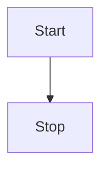

# markdown常用语法

## 1 图片加载
)
## 2 超链接
[JAVA下载](https://www.java.com/zh_CN/)
## 3 索引的使用
[JAVA下载][1]
## 4 表格
|  列名1 |  列名2 | 列名3 |
| ------ | ------ | ------ |
| 内容 | 内容 | 内容 |
## 5 显示代码
### 5.1 一段C语言代码
```c
 int main() {
     printf("hello world")
 }
```
### 5.2 一段java语言代码
```java
 class Animal {
    public Animal(){
    }
    public static main() {
        Animal a = new Animal()
    }
 }
```
## 引用别人的话
Linus说:
>Talk is cheap. Show me the code
## 使用[mermaid](https://mermaidjs.github.io/?q=)插件画图

### 流程图



[1]:https://www.java.com/zh_CN/


